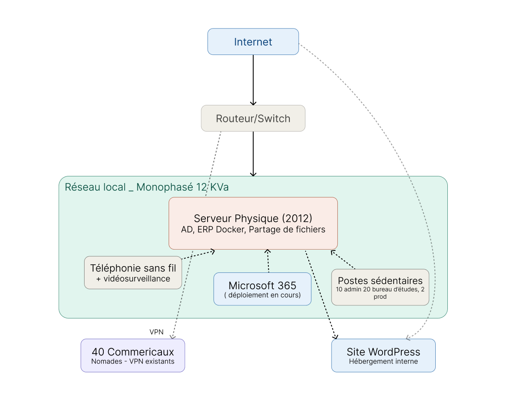
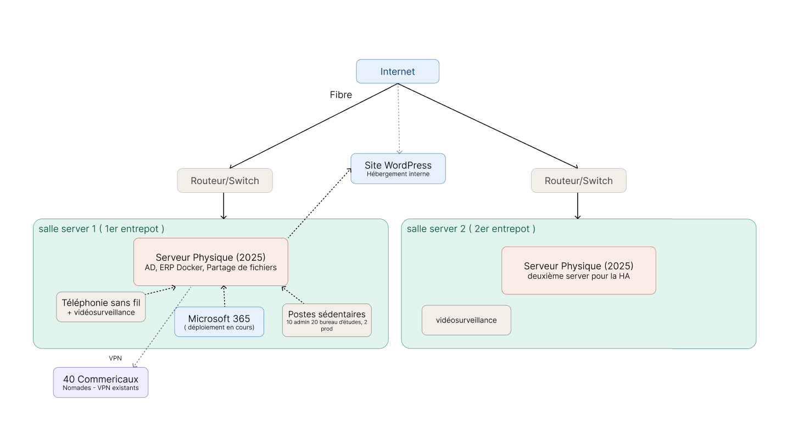
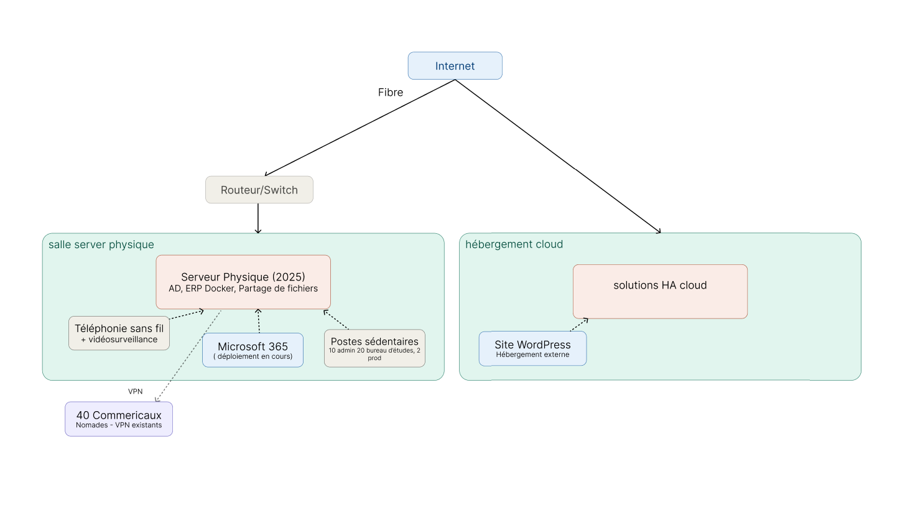

# Architecture.

voici l'architecture de l'infra actuel de airsolid.

### Serveur physique (2012) — pièce maîtresse et point de défaillance unique
Un seul serveur physique héberge l'intégralité des services critiques : l'Active Directory (annuaire de l'entreprise), l'ERP web sous Docker, et les partages de fichiers Windows. Sa configuration exacte est inconnue du management. Une panne de 48h a déjà paralysé l'activité complète. C'est le risque numéro 1.

### Réseau local

Alimentation monophasée de 12 kVA — insuffisante pour héberger une infrastructure redondante ou une salle serveur sérieuse. La segmentation réseau (bureau / production / éventuellement entrepôt futur) n'est pas documentée.
Connectivité internet
Une seule fibre professionnelle à 1 Gbps. Pas de lien de secours : toute coupure opérateur = arrêt total pour les nomades et les services dépendant du cloud (M365 en déploiement).

### Accès distant
Un VPN est en place pour les 40 commerciaux nomades, mais sa qualité de service n'a jamais été évaluée formellement. Aucun accès préstataire externe formalisé.
Applications
ServiceHébergementÉtatActive DirectoryServeur 2012En production, critiqueERP (app web Docker)Serveur 2012En production, critiquePartages fichiersServeur 2012En productionMicrosoft 365Cloud MicrosoftDéploiement en coursSite WordPressInterne (serveur ?)En production, non sécuriséTéléphonie sans filLocalType non préciséVidéosurveillanceLocalAccès distant non formalisé 

## Archi on prem proposée :

archi on prem :

2 serveur physiques : 

1 salle serveur déjà existantes 
1 salle serveur dans l'entrepot en cours d'acquisition. 

pour le budjet on a pris : 

serveur hp 10eme gen avec 128go de ram et 50to de stockage. 

4 000–10 000 € achat d'un serveur 
Maintenance / pannes / disques : ~300–1 000 €/an

soit, pour les 2 serveurs (site principal + entrepôt) : 8 000–20 000 € d'achat, 600–2 000 €/an de maintenance

On serait sur une proposition de passif/actif avec celui de l'entrepot 2 qui servirait de passif si l'actif tombe. 
temps de reprise en HA attendu a 30sec / 5 mins

## archi hybride physique/cloud ha

archi hybride : 

1 serveur physique dans la salle server existante. 

même server que pour la solution onprem

Côté cloud : 

A. Site miroir (HA simple) :

copie du site interne
hébergée sur 1–2 VM cloud
 - si ton serveur tombe :
site continue en cloud
 - 1 à 10 minutes de bascule

B. Active Directory secondaire
1 contrôleur AD dans le cloud
réplication automatique
si serveur HS :
authentification continue

C. VPN de secours
instance VPN cloud (WireGuard / OpenVPN / Azure VPN)
activation automatique ou manuelle rapide

D. Sauvegardes des données

backup complet + incrémental
stockage object storage (OVH / S3 / équivalent)
versioning + historique
10–50 To en backup
pas en usage actif

E. ERP ( access, microsoft 365)

réplication quasi temps réel de l’ERP
serveur principal = actif
cloud = miroir chaud (warm standby)

### Coût

Serveur physique : 

~6 000–20 000 €/5 ans avec maintenance et coût de l'elec.

Cloud minimal HA/hybride :

VM standby : 50–300 €/mois
AD + VPN cloud : 50–150 €/mois
stockage 50 To backup : 500–1 200 €/mois

total = 600–1 650 €/mois soit 7 200–19 800 €/an (infra cloud seule : VM + AD/VPN + stockage — hors licences/MCO/connectivité déjà comptés dans le tableau comparatif ci-dessous)

( si panne totale = plus cher )

### Conclusion 

👉 Le cloud est :

✔ flexible
✔ scalable
✔ sans maintenance
❌ très cher pour 50 To constants

👉 Le serveur HP est :

✔ énormément moins cher à long terme
✔ parfait pour charge stable
❌ moins flexible
❌ maintenance à gérer

| Scénario        | Avantages                     | Inconvénients                   | Coût estimé / an |
| --------------- | ----------------------------- | ------------------------------- | ---------------- |
| Full on-premise | Maîtrise totale, CapEx        | Risque panne matérielle, MCO    | 20 000–39 000 €  |
| Cloud hybride   | Résilience + maîtrise données | Coût récurrent OpEx             | 19 000–38 000 €  |